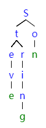

# 字典树
*又称：Trie树，前缀树。本质上是用树去存储字符串*  

## 逻辑结构
字典树把字符串看成字符序列，根据字符串中字符序列的先后顺序构造从上到下的树结构，树结构中的每一个节点存储一个字符，并且这些节点应当是*可被标记的*。如果一个节点被标记为结束节点，那么从根节点到这个节点的路径中，按顺序经过的字符组成的字符串，就是存在树里的一个字符串。字典树上存储的字符串被视为从根节点到某个节点之间的一个序列，序列的终点节点上要标记"该节点对应词语的结尾"  

## 性质  
* 根节点不包含字符，除了根节点以外每个节点只包含一个字符
* 从根节点到某个节点，路径上的字符按顺序串起来就是**该节点**对应的字符串

## 优点
利用字符串的公共前缀，最大限度减少无谓的字符串比较，减少了查询时间，查询效率比哈希树高   
利用空间来换取时间  

## ADT
- Trie() 初始化一棵前缀树
- void insert(string word) 插入字符串
- bool search(string word) 搜索字符串
- bool startWith(string prefix) 搜索前缀为prefix的字符串
- void delete(string word) 很少使用的删除操作

## ADT的实现
**insert**：程序从root开始向下遍历，同时从字符串开头向结尾遍历。一个一个匹配，对应字母已经在树中就继续向下走，没有就新建节点。到字符串结尾，对应节点做结束标记即可。  

---
以目前的要求，我對字典樹的了解就到這裏結束。實際使用會結合AC自動機等複雜的算法，具體實現一棵字典樹也等有時間了再搞